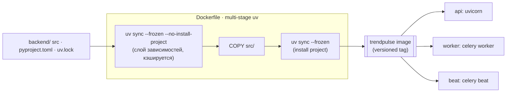
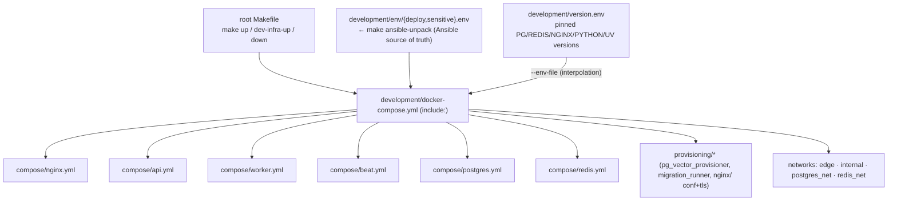
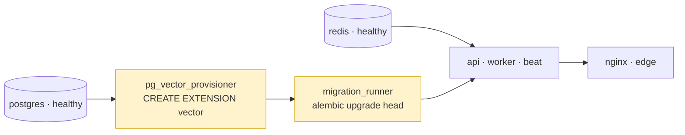
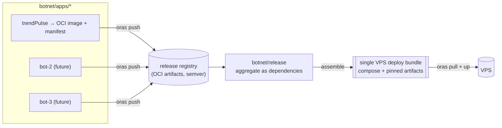

# TrendPulse — Build & Release

> Как проект собирается сегодня (Docker + uv + per-service compose) и как будет дистрибутироваться в будущем (OCI-артефакты через **ORAS** в `release`-репо → один VPS-бандл). Будущая часть — **только при проектировании**, не реализуем сейчас.

Связано: [high-level-architecture.md](./high-level-architecture.md), [ADR-005](./adr-005-infra-provisioning-and-secrets.md), [ADR-006](./adr-006-packaging-and-release.md), [network-design.md](./network-design.md).

---

## 1. Сборка backend-образа (сейчас)

Multi-stage на `uv` (эталон `ma/prediction`): зависимости ставятся по `uv.lock` отдельным слоем, затем код. Один образ для `api`/`worker`/`beat` — различие лишь в команде запуска.

## 2. Ассемблирование окружения (compose `include`)

`development/docker-compose.yml` через `include:` собирает per-service файлы и объявляет сети. `make` — единственная точка входа.

## 3. Старт-ордер (provisioning перед app)

`api`/`worker`/`beat` ждут `condition: service_completed_successfully` обоих провижинеров (ADR-005 §3).

## 4. Дистрибуция через ORAS (БУДУЩЕЕ — учитываем при проектировании)

Каждое приложение/бот (`trendPulse` и будущие боты в `botnet/apps/*`) собирается в **версионированный OCI-образ** и публикуется как **OCI-артефакт через ORAS** в репозиторий `botnet/release`. `release` агрегирует все боты как **зависимости** и собирает **один удобный VPS-деплой** (единый bundle: pinned-ссылки на артефакты + общий compose/манифест + сети + provisioning).

### Что это требует от дизайна УЖЕ сейчас (чтобы потом «просто заработало»)

- **12-factor config:** вся конфигурация — через env (`deploy.env`/`sensitive.env`), никаких build-time привязок к хосту/путям. Образ переносим как есть.
- **Версионирование:** образы и артефакты тегируются semver; деплой ссылается на pinned-версии (воспроизводимость).
- **Самодостаточность образа:** один образ `api`/`worker`/`beat`, команда — снаружи; нет «магии» вне контейнера.
- **Сети/секреты — декларативно:** топология сетей (network-design) и секреты (Ansible/vault) описаны так, что `release`-бандл их переиспользует, а не переопределяет.
- **Provisioning как артефакт:** `pg_vector_provisioner`/`migration_runner` — тоже образы/шаги, переносимые в бандл.

> Реализация ORAS/`release` — **не в текущем скоупе**. Здесь зафиксирован вектор, чтобы task-001/012 и будущие боты не закладывали host-coupling. См. [ADR-006](./adr-006-packaging-and-release.md).
