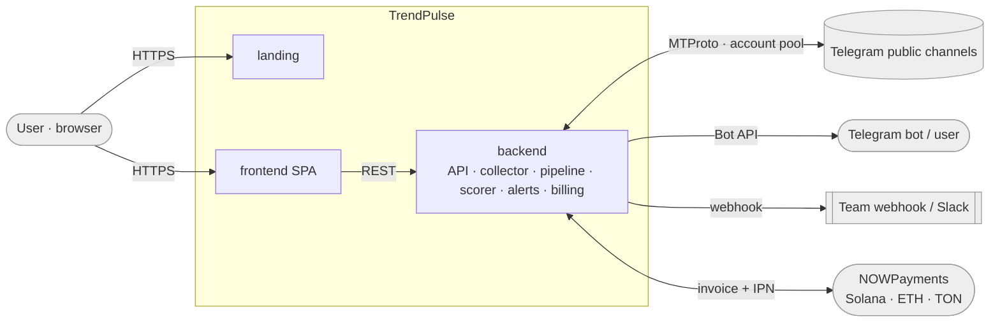
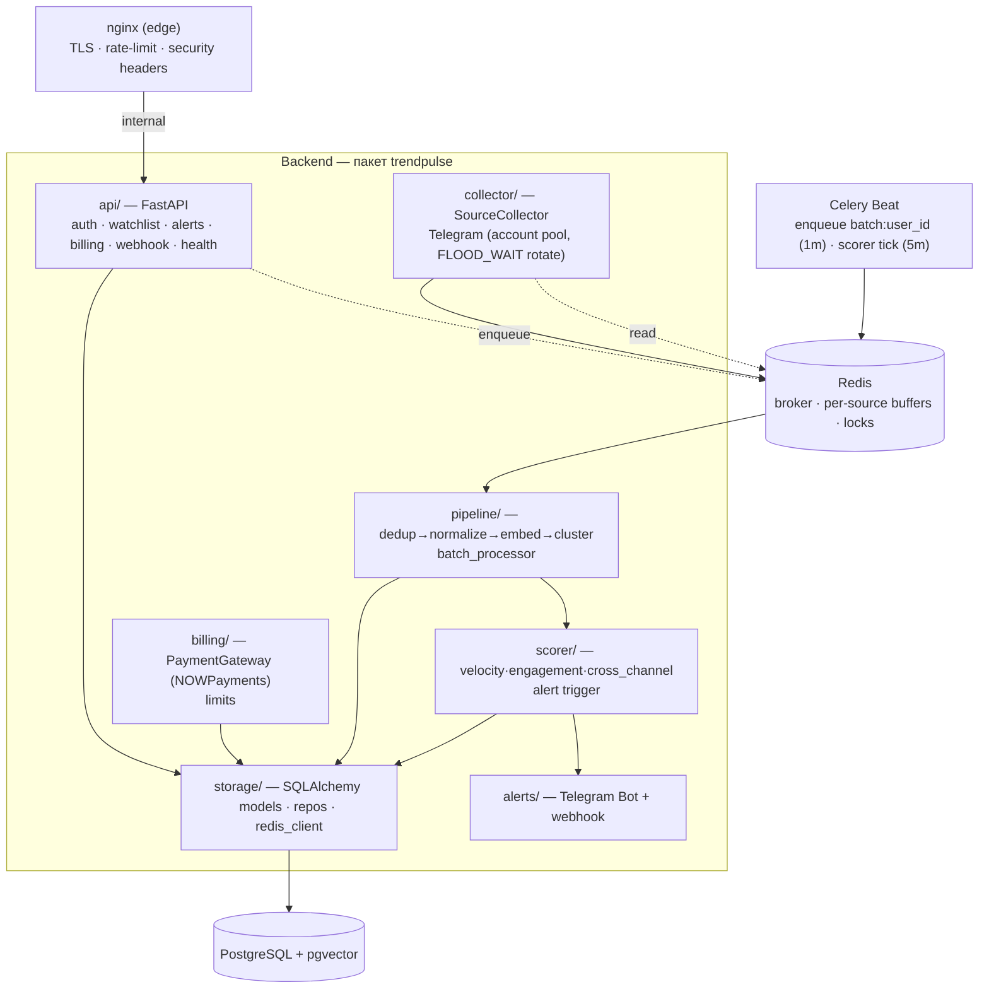
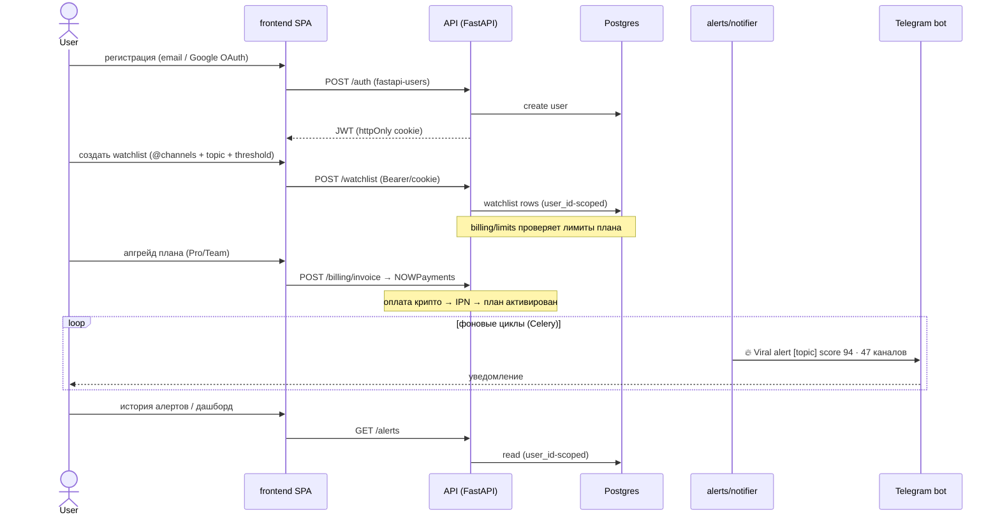
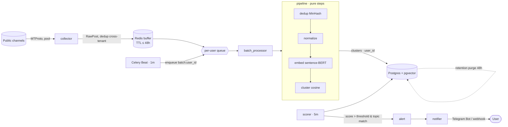

# TrendPulse — High-Level Architecture

> Персональный детектор вирусного контента. Мониторит публичные источники (сейчас — Telegram-каналы), кластеризует похожие новости across источников, считает viral score и шлёт сигнал быстрее мейнстрима.

Status: **architecture baseline (Pre-MVP)** · Источник истины: [`../product/overview.md`](../product/overview.md)
ADRs: [001 source-abstraction](./adr-001-source-abstraction.md) · [002 multi-tenancy](./adr-002-multi-tenancy-and-queues.md) · [003 monorepo+auth](./adr-003-monorepo-and-auth.md) · [004 crypto-billing](./adr-004-crypto-billing-nowpayments.md) · [005 infra+secrets](./adr-005-infra-provisioning-and-secrets.md) · [006 packaging/ORAS](./adr-006-packaging-and-release.md)
Связанное: [network-design.md](./network-design.md) · [build-and-release.md](./build-and-release.md) · [roadmap.md](./roadmap.md)

---

## 1. System context (C4 L1)

**Future sources** (Twitter/X и др.) подключаются через единый `SourceCollector` — [ADR-001](./adr-001-source-abstraction.md). Сейчас реализован только Telegram; ядро source-agnostic.

## 2. Apps (monorepo `apps/trendPulse/`)

| App | Stack | Назначение |
|---|---|---|
| `backend/` | Python 3.12 · FastAPI · Celery+Redis · SQLAlchemy+pgvector | API, сбор, pipeline, scoring, alerts, billing |
| `landing/` | React + Vite (SSG/static) | Маркетинговый лендинг, конверсия, pricing |
| `frontend/` | Vite + React SPA | Дашборд: watchlist, история алертов, биллинг |
| `development/` | **root `Makefile`** + per-service compose + provisioning | Единый оркестратор окружения ([ADR-005](./adr-005-infra-provisioning-and-secrets.md)) |
| `ops/` | Terraform + Ansible | IaC внешних сервисов + доставка секретов |

## 3. Component diagram (C4 L2) — backend + инфраструктура

Доменные модули пакета `trendpulse` (src-layout `backend/src/trendpulse/`):

| Module | Отвечает за |
|---|---|
| `api/` | HTTP-роуты, Pydantic-схемы, auth (fastapi-users), зависимости |
| `collector/` | `SourceCollector` + Telegram-реализация, пул аккаунтов |
| `pipeline/` | pure-steps `dedup → normalize → embed → cluster`, `batch_processor` |
| `scorer/` | viral score, alert-триггер по порогу пользователя |
| `alerts/` | доставка (Telegram Bot API, webhook) |
| `billing/` | `PaymentGateway` (NOWPayments), тарифы, лимиты |
| `storage/` | SQLAlchemy-модели, репозитории, Redis-клиент, миграции |
| `config.py` · `celery_app.py` · `scheduler.py` | настройки, Celery app, beat schedule |

## 4. User flow (что делает пользователь)

## 5. Data flow (как рождается сигнал)

**Ключевые свойства потока:** канал читается один раз для всех тенантов (cross-tenant dedup, [ADR-002](./adr-002-multi-tenancy-and-queues.md)); pipeline-шаги работают только с нормализованным `RawPost`/`NormalizedPost` ([ADR-001](./adr-001-source-abstraction.md)) — платформо-независимы; сырой контент живёт ≤ 48h (overview §7).

Формула: `viral_score = velocity·0.4 + engagement·0.35 + cross_channel·0.25`.

## 6. Cross-cutting

- **Multi-tenancy.** Всё пользовательское изолировано по `user_id`; очереди per-user; источники дедуплицируются на уровне пула — [ADR-002](./adr-002-multi-tenancy-and-queues.md).
- **Source abstraction.** Новый источник = новая реализация `SourceCollector` — [ADR-001](./adr-001-source-abstraction.md).
- **Auth.** Библиотека `fastapi-users` (email/пароль + Google OAuth, JWT/cookie) — [ADR-003](./adr-003-monorepo-and-auth.md).
- **Billing.** Крипто через NOWPayments за абстракцией `PaymentGateway` — [ADR-004](./adr-004-crypto-billing-nowpayments.md).
- **Network/secrets.** Наружу только nginx; БД/Redis изолированы; env split + Ansible как источник истины — [network-design.md](./network-design.md), [ADR-005](./adr-005-infra-provisioning-and-secrets.md).
- **Rate limits.** `FLOOD_WAIT` → backoff + ротация аккаунтов пула.
- **Observability.** структурные логи (агрегированные метрики, не содержимое сообщений), health/ready.

## 7. Deployment & build (MVP → future)

Один образ приложения для `api`/`worker`/`beat` (различие — команда), за ним nginx (edge) и изолированные Postgres/Redis. Сборка/провижининг/старт-ордер и **будущая дистрибуция через ORAS в `release`-репо** — отдельный документ [build-and-release.md](./build-and-release.md). Управление — root `Makefile` (`make up` / `make dev-infra-up` / `make down`). Целевая инфра MVP — VPS (~$30–60/мес).

## 8. Tech risks → mitigations

| Риск | Mitigation |
|---|---|
| Telegram rate limits | пул технических аккаунтов, backoff, ротация (ADR-001/002) |
| ML-стек тяжёлый (torch) | dependency-group `ml` только в worker; api лёгкий |
| pgvector dimension drift | фиксированная размерность эмбеддинга в схеме + проверка |
| Гонки старта/тенантов | healthchecks; provisioning-ордер; `max_instances=1` на батч |
| Vendor lock (источник/платёж) | абстракции `SourceCollector` / `PaymentGateway` с первого дня |
| Связность деплоя многих ботов | OCI-артефакты + сборка одного VPS-бандла (ADR-006, build-and-release) |
