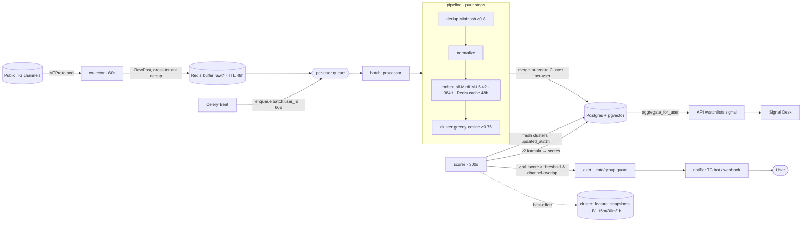

# Architecture State 01 — Текущее состояние скоринга (AS-IS)

> Снимок «как система рождает сигнал **сейчас**», на 2026-06-16. Источник истины по коду —
> grep/чтение `backend/src/`. Парный документ — [`02-state-target.md`](./02-state-target.md) (TO-BE) и
> [`03-scoring-evolution-plan.md`](./03-scoring-evolution-plan.md) (план перехода).
> Продуктовая проекция — [`../../product/states/01-state-current.md`](../../product/states/01-state-current.md).

Status: **factual baseline** · проверено по коду и по проду (psql/логи, см. [`cache/trendpulse-scoring-fix-tasks.md`](../../../../../cache/trendpulse-scoring-fix-tasks.md)).

---

## 1. Краткий вердикт

Скоринг **жив и осмыслен на малой выборке**, но **голодает по данным** и **показывает не ту метрику**.
Пайплайн `posts → buffer → drain → dedup → normalize → embed → cluster → score → alert` работает
end-to-end; формула v2 на судейской выборке n=35 даёт ROC-AUC **0.859** (было 0.564). Но в живом
потоке ~88% кластеров одноканальные → `velocity≈0`, `cross_channel≈0`, `viral_score` avg≈21 (ниже
alert-порога) → `created_alerts=0`. Самые сильные офлайн-наработки (GBDT, science-фичи) **не подключены**.

---

## 2. Поток сигнала (live data flow)



**Кадансы (Celery Beat, `scheduler.py`):** collect-tick 60s · enqueue-batches 60s · score-tick **300s**.
Сквозная задержка post→alert ≈ 60s (batch) + ≤300s (scorer) ≈ **до ~6 мин** (это P3, «продаём скорость, но она ~6 мин»).

---

## 3. Формула v2 (что реально в проде)

`backend/src/scorer/score.py`:

```
viral_score = 100 · ( engagement·0.55 + cross_channel·0.30 + velocity·0.15 )     ∈ [0,100]

engagement   = min( log1p(views + 3·forwards + 2·reactions) / 14.0 , 1 )         # доминанта
cross_channel= min( unique_channels / watched_channels , 1 )                       # охват watchlist
velocity     = min( log1p(max(Δchannels−1,0)) / max(Δhours,1ч) / 3.0 , 1 )         # кросс-канальный burst
```

- **Матчинг кластер→топик — по пересечению каналов** (`_match_topic_by_channels`), НЕ по строке (TASK-084).
- **Anti-fatigue:** rate-guard (alerts/час) + group-guard (дубль `(user,topic)` в окне).
- **Окна:** scoreable cluster `updated_at ≤ 1ч`; метрики из rolling-окна 24ч; baseline канала — 7д.

## 4. Кластеризация (где рождается «широта темы»)

- **Greedy single-link**, cosine ≥ `0.75`, центроид = бегущее среднее; **per-batch**, scope = **per-user**.
- **Cross-batch merge (TASK-080):** кандидат мёржится в свежий кластер того же юзера (cosine ≥0.75,
  `updated_at ≤24ч`, `first_seen ≤72ч`) — иначе новый. Убирает дубль-кластеры, держит «одну историю» вместе.
- `channels_count` = реальное число distinct-каналов кластера в окне 24ч (не прокси).

## 5. Что WIRED vs DORMANT (ключевая таблица)

| Актив | Где | Статус | Замеренное качество |
|---|---|---|---|
| **v2 формула** | `scorer/score.py` | **WIRED (единственный live-скорер)** | judged n=35 AUC **0.859**; Higgs PR-AUC 0.914@1ч; на «backfill»-корпусе деградирует |
| Channel-overlap матчинг, rate/group guard | `scorer/tasks.py` | **WIRED** | — |
| Cross-batch merge | `pipeline/batch_processor.py` | **WIRED** | убирает 753 дубль-группы / 3010 кластеров |
| **B1 snapshots** (15m/30m/1h, metrics-only) | `scorer/tasks.py:_capture_feature_snapshots` | **WIRED (копится в проде)** | питает будущий TG-GBDT; 1ч-окно backfill-prone |
| **GBDT viral-модель** | `scorer/viral_model.py` + `models/viral_gbdt_higgs_1h.txt` | **DORMANT (не вызывается)** | Higgs PR-AUC **0.920@1ч**, Brier 0.106 (калибрована) |
| **Science-фичи** (EWMA vel/accel, Hawkes n\*, eff-independent-sources, TiDeH, authority) | `eval/science_features.py` | **DORMANT (offline)** | standalone: eff-sources PR-AUC **0.831**, Hawkes **0.721**; маржинальный lift на Higgs ≈0 |
| Quality-gate (фильтр треш-кластеров) | `eval/quality.py` | **DORMANT (offline)** | режет 68% синглтонов/мега-бакетов/дублей |
| Forward time-split, eval-харнессы | `eval/forward_split.py`, `eval/metrics.py`, `eval_offline/` | **DORMANT (offline)** | методология leak-free; воспроизводит baseline |

## 6. Что показывает UI vs что есть

API `/watchlists` (`signal_repo.aggregate_for_user`) уже возвращает `live_score` (viral_score 0–100),
`live_velocity` (терм 0–1), `sparkline_24h` (по viral_score), `last_alert_at`. **Но фронт акцентирует
velocity-бейдж** (`×baseline ≈0` на одноканальных) → пользователь видит «мёртвый» сигнал, хотя `viral_score`
avg≈21 уже есть. То есть быстрый выигрыш — **показать то, что уже посчитано**.

## 7. Диагноз по проду (факт, user_id=2, 2ч окно)

| Метрика | Значение | Вывод |
|---|---|---|
| `scores` rows/2ч | 66 | scorer работает |
| `viral_score` avg/max | **21.0 / 47.4** | сигнал есть, но < alert-порога → 0 алертов |
| `engagement` avg/max | 0.359 / 0.75 | реальный драйвер |
| `velocity` avg/max | 0.032 / 0.37 | ≈0 (одноканальность) |
| `cross_channel` avg | 0.026 | ≈0 |
| `channels_count` | 1→121, 2→10, 3→5, … | **~88% кластеров одноканальные** |
| posts-per-cluster | 1→6204, 2→1208, … | большинство — синглтоны |
| ingest | 2 сессии, ~37 постов/ч, 22 канала/ч | поток жидкий |

## 8. Пять структурных дефицитов (что НЕ хватает)

1. **Кросс-канальной широты.** velocity/cross_channel структурно =0 пока тема в 1 канале → моат не считается.
2. **Объёма/перекрытия ingest.** 6204 синглтона = мало каналов на одно событие (2 сессии мало).
3. **Правильной метрики в UI.** Показываем velocity (≈0), а не viral_score/engagement (есть сигнал).
4. **Рабочей velocity/accel-метрики.** Дизайн velocity дегенеративен (AUC≈0.07 на сыром корпусе).
5. **ML в проде.** GBDT и science-фичи лежат offline; live-скорер их не зовёт.

> Эти 5 дефицитов — вход для [`03-scoring-evolution-plan.md`](./03-scoring-evolution-plan.md) (серия S1…Sn).
