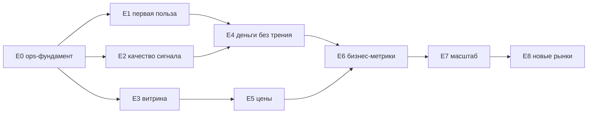

# TrendPulse — Epics (Epic E «Path to revenue»)

> Источники: продуктовый разбор «улучшения → деньги» и архитектурный разбор болевых точек
> (перенесён в [`../../architecture/pain-points.md`](../../architecture/pain-points.md)).
> Главная мысль: **движок построен (эпики A–D done), провисает «последняя миля» до пользователя и до кошелька.**
> Цель волны: **первый платящий пользователь → $2k MRR**, не «ещё код».

## Финальная точка (Definition of Done всей волны)

1. Новый пользователь за **минуту** после регистрации видит релевантные вирусные сигналы (E1).
2. Точность сигнала **измеряется** (👍/👎 + precision per user) и порог подстраивается (E2).
3. Публичный канал-витрина **сам приводит** пользователей (E3).
4. Оплатить и продлить можно **без трения** (годовой план, one-click renewal, grace) (E4).
5. Цены отражают **ценность** (скорость/точность/API), Free = воронка (E5).
6. На одном экране видно MRR, воронку активации и **задержку сигнала p50/p95** (E6).
7. Стоимость растёт от **числа постов**, а не от числа юзеров; пул аккаунтов под контролем (E0/E7).
8. Расширение (Twitter, B2B) — **только после** денег на основном рынке (E8).

## Эпики и порядок

| Эпик | Название | Волна | Задачи | Статус |
|------|----------|-------|--------|--------|
| [E0](./epic-e0-survival-ops.md) | Выживание и ops-фундамент (P1/P2/P3/P4/P7/P8) | СЕЙЧАС | TASK-056, 034…037 | planned (доки готовы) |
| [E1](./epic-e1-first-value.md) | Первая польза за 30 секунд | СЕЙЧАС | TASK-038…040 | planned (доки готовы) |
| [E2](./epic-e2-signal-quality.md) | Качество сигнала = удержание | СЕЙЧАС | TASK-041…043 | defined |
| [E3](./epic-e3-showcase-channel.md) | Витрина-канал в Telegram | СЕЙЧАС | TASK-044…046 | defined |
| [E4](./epic-e4-frictionless-money.md) | Деньги без трения | после E1–E3 | TASK-047…048 | defined |
| [E5](./epic-e5-pricing-packaging.md) | Упаковка и цены | после E3 | TASK-049 (+030) | defined |
| [E6](./epic-e6-business-metrics.md) | Бизнес-метрики | после E4 | TASK-050…051 (+036) | defined |
| [E7](./epic-e7-cost-and-scale.md) | Стоимость и масштаб | после E6 | TASK-052…055 | defined |
| [E8](./epic-e8-new-sources-markets.md) | Новые источники и рынки | после $2k MRR | TASK-031 + future | defined |

Статусы: **planned (доки готовы)** — task-доки созданы `trendpulse-plan`, готовы к `trendpulse-executor`;
**defined** — задачи зафиксированы здесь (цель + DoD), task-док создаётся `trendpulse-plan` при взятии в работу
(номера TASK-041+ зарезервированы — не переиспользовать).

## Зависимости

E0–E3 ведутся параллельно (независимы). Включать платный маркетинг до завершения E1–E3 — нет смысла:
человеку нечего полюбить.

## Критический путь до первого доллара

`TASK-056 (Hetzner-бакет) → TASK-034 (бэкапы) → TASK-038 (packs) → TASK-039 (instant value) →
TASK-040 (free-delay) → TASK-042 (👍/👎) → TASK-044 (витрина) → TASK-049 (цены) → первый платящий`

## Незакрытый хвост Epic D (паркуется, приоритет ниже волны E)

- TASK-029 SSR — in-progress (взят до волны E); довести и после него — строго E0/E1.
- TASK-030 API hardening — поднимается вместе с E5 (продажа API-тарифа требует стабильного контракта).
- TASK-032 security hardening (at-rest шифрование = P5 «навсегда») — перед публичным запуском / первым B2B.
- TASK-033 GDPR export — compliance-бэклог, по требованию.
